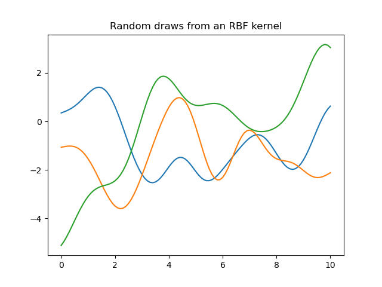
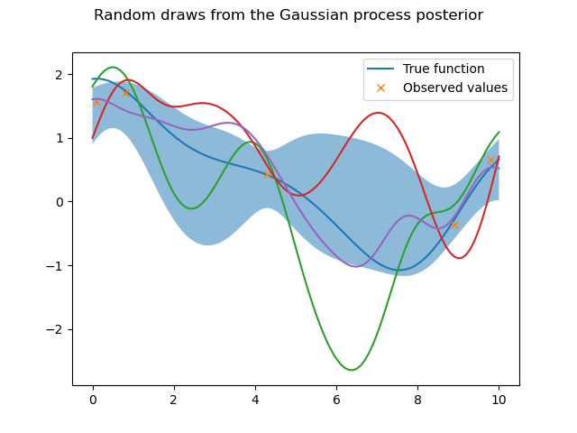

# MLPR

Some code snippets I implemented for the course [Machine Learning and Pattern Recognition](https://mlpr.inf.ed.ac.uk/2021/) at [The University of Edinburgh](https://www.ed.ac.uk/informatics).
Note: this code is not optimised and solely meant for demonstration and understanding purposes.

## Bayesian Model Choice

Bayesian methods applied to regression to determine the more likely model.
First, three random functions are drawn from linear and quadratic priors.
Five noisy data points are then generated according to an underlying quadratic distribution.
Finally, the posterior distributions are calculated, followed by the model's marginal likelihood.

<!--  -->

Sample output:

 
```
p(y | X, M='Linear') = 4.3328164967564665e-10
p(y | X, M='Quadratic') = 6.923278357438273e-09
```

## Gaussian Process

Similar to Bayesian model choice, three random functions are drawn from an RBF kernel with 0 mean, 2 variance, 1 lengthscale.
About 2/3 of the function values are expected to be within +- of the function variance, and the lengthscale indicates the typical distance between turning points of a function.
Then, the Gaussian process posterior is calculated from five noisy data points based on the true weights for the RBFs.
In the plot a 1 std confidence interval is shown.

 
