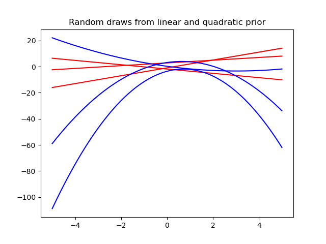
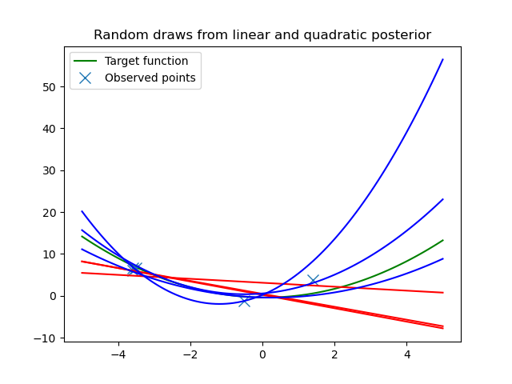

# MLPR

Some code snippets I implemented for the course [Machine Learning and Pattern Recognition](https://mlpr.inf.ed.ac.uk/2021/) at [The University of Edinburgh](https://www.ed.ac.uk/informatics).

## Bayesian Model Choice

Bayesian methods applied to regression to determine the more likely model.
First, three random functions are drawn from linear and quadratic priors.
Five noisy data points are then generated according to an underlying quadratic distribution.
Finally, the posterior distributions are calculated, followed by the model's marginal likelihood.

<!--  -->

Sample output:

 
```
p(y | X, M='Linear') = 4.3328164967564665e-10
p(y | X, M='Quadratic') = 6.923278357438273e-09
```
